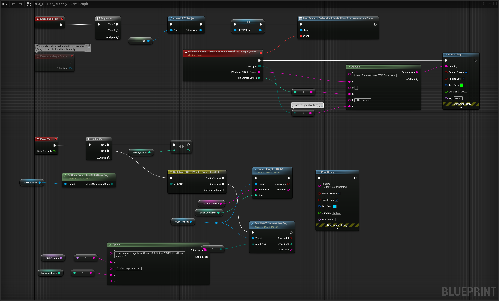

**Note:** There is a bug with the github DownloadZIP(".map" asset file are Git LFS file, Github DownloadZIP results in the ".map" file only 1KB).  **You should clone this repository by HTTPs of this git, Not by Github DownloadZIP.**

# PRODUCT TITLE：

**UE-TCP (UETCP, TCP Blueprint For UE)**

**UE Marketplace:** https://www.unrealengine.com/marketplace/en-US/product/ue-tcp-uetcp-tcp-blueprint-for-ue

# SHORT DESCRIPTION：

Only need to use the blueprints, you can send and receive TCP(Transmission Control Protocol) messages. It is cross-platform and supports Unicode characters. The most important thing is that it is very easy to use.

# LONG DESCRIPTION：

This plugin encapsulates the implementation of TCP. 

Only need to use the blueprints, you can send and receive TCP messages. 

This plugin supports multiple platforms: iOS, Windows, Mac, etc. 

It supports Unicode characters. 

After using this plugin, you will find that it is so simple to receive and send TCP messages. 

# Blueprint nodes overview of "UE-TCP"

**Level Blueprint Of This Map**:`'./UETCPDemo/MAPs/MAP_UETCPDemo_Overview'`

## Detailed description of each node

### UE-TCP Blueprint Library Nodes:

**"1"**: **CreateUETCPObject**, Instantiates a new UETCP Object for the current platform.

**"2"**: **BytesToString**, Converts bytes to string.

**"3"**: **StringToBytes**, Converts string to bytes.

**"1"**: **SetMaxBacklog**

> 	Server Only.
> 	MaxBacklog: The number of connections to queue before refusing them.
> 	Call this function before calling "Listen(ServerOnly)".

**"2"**: **Listen(ServerOnly)**, Listen for incoming connections. Server Only.

**"3"**: **GetServerClientConnections(ServerOnly)**,  Get the "UUETCPServerClientConnection" Objects.

**"4"**: **GetServerListenPort(ServerOnly)**, Get server listen port. Server Only.

**"5"**: **GetLocalBindAddress**, Get local IP to bind to.

**"6"**: **GetLocalHostAddress**, Uses the platform specific look up to determine the host address.

**"7"**: **BindEventTo OnReceivedNewTCPConnectionRequest(ServerOnly)**, Delegate called when new TCP Connection Request is received. ServerOnly.

**"1"**: **SendDataToClient(ServerOnly)**, Use the Server "UETCPServerClientConnection" Object to Send data to client.

**"2"**: **GetServerAddressInfo(ServerOnly)**, Use the Server "UETCPServerClientConnection" Object to get Server Address Info.

**"3"**: **GetConnectionState(ServerOnly)**, Use the Server "UETCPServerClientConnection" Object to get  Connection State.

**"4"**: **GetClientAddressInfo(ServerOnly)**, Use the Server "UETCPServerClientConnection" Object to get Client Address Info.

**"5"**: **Close**, Close the Connection fo Server "UETCPServerClientConnection" Object.

**"6"**: **BindEventTo OnReceivedNewTCPDataFromClient(ServerOnly)**, Delegate called when new TCP data is received by Server.

**"1"**: **ConnectTo(ClientOnly)**, This Client Connects to server. Client Only.

**"2"**: **SendDataToServer(ClientOnly)**, On client, use the "UUETCPObject"  Object to Send Data To Server.

**"3"**: **GetClientConnectionState(ClientOnly)**, On client, use the "UUETCPObject"  Object to get Client Connection State.

**"4"**: **GetLocalBindAddress**, Get local IP to bind to.

**"5"**: **GetLocalHostAddress**, Uses the platform specific look up to determine the host address.

**"6"**: **BindEventTo OnReceivedNewTCPDataFromServer(ClientOnly)**, Delegate called when new TCP data is received by Client. Client Only.

# Example Introduction

Two TCP client Actors connect to one TCP server Actor. In each frame, the TCP server sends messages containing Unicode characters to the TCP clients, and each TCP client sends messages containing Unicode characters to the TCP server.

## “BPA_UETCP_Client”

**Actor**:`./UETCPDemo/BPs/BPAs/BPA_UETCP_Client'`

## “BPA_UETCP_Server”

**Actor**:`./UETCPDemo/BPs/BPAs/BPA_UETCP_Server'`

